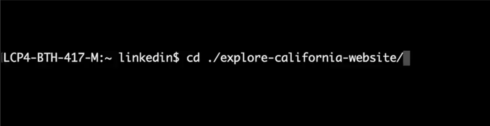
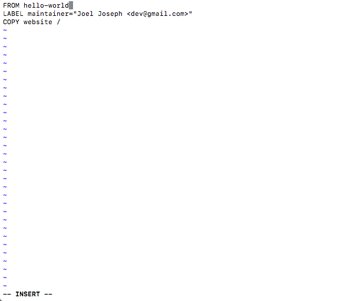

# DevOps Foundations

## Writing into a Dockerfile

### Step 1: 
Go into the directory where you want to write the Dockerfile.  


### Step 2: 
Create a Dockerfile by entering the following command into the terminal:  
```bash
touch Dockerfile
```

### Step 3: 
Use the following command to open the Dockerfile in `vim`:  
```bash
vim Dockerfile
```

### Step 4: 
Write into the Dockerfile!  


### Step 5: 
Save and exit the file:  
- Press the `Esc` key.  
- Type `:w` to save.  
- Type `:q` to quit.

### Thats your first Dockerfile!
